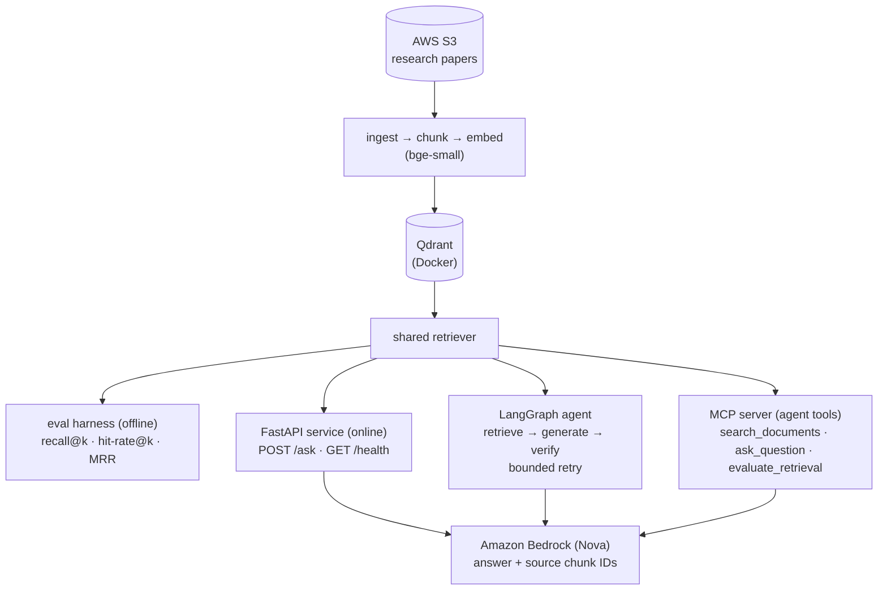
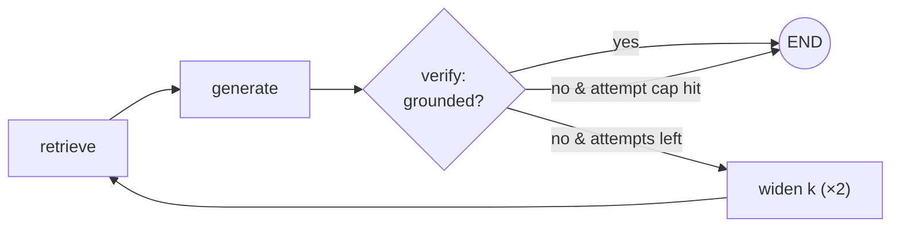

# RAG Evaluation Pipeline

Retrieval-augmented question answering over a corpus of NLP research papers (coreference
resolution and low-resource language modeling) — the kind of literature review this was
built to make searchable. A grounded question-answering backend and retrieval-evaluation
harness: ask a question, get an answer grounded in the source papers with citations.

The project is built around a **from-scratch retrieval evaluation harness**: the emphasis
is on *measuring* retrieval quality — recall@k, hit-rate@k, and MRR — rather than just
demonstrating that a RAG pipeline returns an answer.

48 papers are chunked, embedded with `bge-small-en-v1.5` and indexed in **Qdrant**, then
retrieved through a *single* path shared by the evaluation harness (offline) and the **FastAPI**
service (online) — so a retrieval improvement measured offline reaches production by construction,
not by convention. Answers are generated by **Amazon Bedrock** in `eu-central-1`, cited down to the
page. The pipeline is also exposed as **MCP tools** and orchestrated as a minimal **LangGraph**
agent, and ships as a container that runs Qdrant *embedded* — no database process, nothing billed
between requests.

## Retrieval results

Measured on a hand-labeled set of 10 questions over a corpus of 48 papers (1,688 chunks).
Recall@k is the fraction of relevant chunks found in the top k; hit-rate@k is whether at
least one relevant chunk is in the top k; MRR is the mean reciprocal rank of the first
relevant chunk.

| k  | recall@k | hit-rate@k | recall@k (9 papers) | hit-rate@k (9 papers) |
|----|----------|------------|---------------------|-----------------------|
| 1  | 0.35     | 0.70       | 0.35                | 0.70                  |
| 3  | 0.55     | 0.80       | 0.65                | 0.80                  |
| 5  | 0.70     | 0.90       | 0.80                | 0.90                  |
| 10 | 0.75     | 0.90       | 0.95                | 1.00                  |
| 20 | 0.85     | 0.90       | —                   | —                     |
| 50 | 0.95     | 1.00       | —                   | —                     |

**MRR: 0.77** (0.79 on the 9-paper corpus).

The corpus was expanded from 9 papers to the 48 that make up the underlying literature
review, and the numbers were re-measured rather than quietly kept. The result is more
interesting than a uniform decline:

- **Top-1 did not move.** recall@1 is still 0.35 and hit-rate@1 still 0.70, despite more
  than five times as many documents competing for the top slot — including a dozen further
  coreference papers covering much the same ground.
- **Depth collapsed.** recall@10 fell 0.95 → 0.75. Gold chunks are not lost — they are
  pushed deeper. Reaching the coverage that k=10 used to give now takes k=50
  (recall@50 0.95, hit-rate@50 1.00).

That changes what the next step should be. The earlier reading — "coverage is solved,
ranking is the bottleneck" — held when recall@10 was 0.95. It no longer does at the depth a
cross-encoder reranker typically works over: at k=20 recall is 0.85, so a reranker fed the
top 20 candidates cannot recover 15% of the relevant material no matter how good it is. The
reranker experiment therefore has to treat the candidate-pool size as a parameter to
measure, not assume. Hybrid (dense + sparse) search is still not obviously required:
hit-rate@50 of 1.00 says dense retrieval does find every question's evidence eventually.

Caveat, stated plainly: this is 10 questions. Each one is 10% of hit-rate, and the moves
above are one or two questions apiece. The numbers are directionally useful and not
statistically meaningful — which is why the next release freezes a ~40-question set before
running any comparison. (Some questions are labeled with more than one relevant chunk,
which caps their attainable recall@1; hit-rate@1 — the right paper ranked first — is the
more representative single-result figure.)

Reproduce with `python -m evaluation.run_eval`, or check against the committed baseline with
`python -m evaluation.compare_baseline`.

The metrics are implemented from scratch (`evaluation/eval_harness.py`) and verified against
hand-computed values, rather than imported from an evaluation library.

## Architecture



The retriever is a single shared component with four consumers — the offline evaluation
harness, the FastAPI service, the LangGraph agent, and the MCP server — so a change in
retrieval strategy is measured and exposed through one code path with no duplication.

## Tech stack

- **Embeddings:** sentence-transformers (`BAAI/bge-small-en-v1.5`), runs on CPU
- **Vector store:** Qdrant, run as a Docker container (via `docker-compose`)
- **Generation:** Amazon Bedrock (`eu.amazon.nova-lite-v1:0`, region `eu-central-1`)
- **Document storage:** AWS S3, with a local-folder fallback for offline development
- **API:** FastAPI + Uvicorn
- **Agent layer:** MCP server (tools for AI agents) and a minimal LangGraph flow
- **Evaluation:** recall@k, hit-rate@k, MRR implemented from scratch

## Project structure

```
rag-eval-pipeline/
├── rag/
│   ├── config.py         # shared settings (collection, model, Qdrant endpoint)
│   ├── types.py          # Chunk: the currency between retrieval and everything downstream
│   ├── ingest.py         # load PDFs (S3 or local), chunk, attach page/section provenance
│   ├── build_index.py    # embed chunks and index them in Qdrant
│   ├── retriever.py      # the single retrieval path, used by eval and serving alike
│   ├── generate.py       # retrieve context and generate an answer via Bedrock
│   └── label_helper.py   # utility for building the eval set
├── api/
│   └── main.py           # FastAPI service: GET /health, POST /ask
├── evaluation/
│   ├── eval_harness.py   # recall@k / hit-rate@k / MRR, implemented from scratch
│   ├── eval_set.jsonl    # hand-labeled question → relevant chunk IDs
│   ├── baseline.json     # committed baseline the eval is compared against
│   ├── compare_baseline.py  # run the eval and diff it against the baseline
│   └── run_eval.py       # score the retriever against the eval set
├── mcp_server/
│   └── server.py         # MCP server: search, QA, and eval as agent tools
├── agent/
│   └── graph.py          # LangGraph flow: retrieve → generate → verify, bounded retry
├── scripts/
│   ├── corpus_manifest.csv  # the 39 fetched papers, with verified source URLs
│   └── fetch_corpus.py   # reproduce the corpus from the manifest
├── tests/                # metrics, chunk-ID stability, provenance, retrieval parity
├── docs/
│   ├── PROJECT_PLAN.md   # design rationale and scope
│   └── decisions/        # observation → decision → trade-off → measured validation
├── .githooks/pre-commit  # fast tests + a duplicate-key check, shared via core.hooksPath
├── docker-compose.yml    # runs the Qdrant container
└── pyproject.toml
```

## Setup

Requires Python 3.12+, Docker, and AWS credentials with access to an Amazon Bedrock model in
`eu-central-1`. S3 is optional — the corpus is read from `data/` unless `RAG_S3_BUCKET` is set.

```bash
python -m venv .venv
source .venv/bin/activate
pip install -e ".[dev]"
```

> If your checkout path contains spaces, invoke tools as `python -m uvicorn`, `python -m pytest`
> and so on. A shebang cannot express an interpreter path with a space in it, so the venv's
> console scripts will not run — the `-m` form is unaffected.

Start the Qdrant vector database (runs as a container; data persists in a named volume):

```bash
docker compose up -d
```

The Qdrant dashboard is then available at http://localhost:6333/dashboard.

Configure AWS credentials for a user with Bedrock invoke and S3 read permissions (e.g. in
`~/.aws/credentials`, region `eu-central-1`).

### The corpus

The PDFs are not in the repository — redistributing papers isn't ours to do — but the recipe is.
`scripts/corpus_manifest.csv` lists 39 open-access papers with verified source URLs, so the corpus
reproduces from a clone:

```bash
python scripts/fetch_corpus.py --dry-run   # review the list first
python scripts/fetch_corpus.py             # ~90s, polite rate limiting
```

Every URL in that manifest was checked by downloading the PDF and confirming the paper's own title
appears on page one, so a lookup that silently returned the wrong document could not get in.

Alternatively, point ingestion at S3 with `export RAG_S3_BUCKET=your-bucket-name`, or drop your own
PDFs into `data/`.

## Usage

```bash
# Start Qdrant (if not already running)
docker compose up -d

# 1. Verify documents load and chunk
python -m rag.ingest

# 2. Embed the chunks and build the Qdrant index
python -m rag.build_index

# 3. Score retrieval against the labeled eval set
python -m evaluation.run_eval

# 4. Serve the API (interactive docs at http://127.0.0.1:8000/docs)
python -m uvicorn api.main:app --reload
```

Ask a question through the API:

```bash
curl -X POST http://127.0.0.1:8000/ask \
  -H "Content-Type: application/json" \
  -d '{"question": "What is the BenCoref dataset?"}'
```

The response contains the generated `answer` and the `sources` (chunk IDs) it was drawn from.

## MCP server (agent tools)

The pipeline is also exposed as an [MCP](https://modelcontextprotocol.io) server, so
MCP-capable AI agents and clients can use it as a set of tools:

- `search_documents(query, k)` — search the corpus, returns ranked chunks
- `ask_question(question, k)` — grounded answer with source chunk IDs (via Bedrock)
- `evaluate_retrieval()` — score the retriever against the labeled eval set

Run it with the MCP Inspector for local testing (requires Node.js; Qdrant must be running):

```bash
mcp dev mcp_server/server.py
```

## Agentic flow (LangGraph)

The pipeline can also run as a minimal LangGraph agent with a bounded
self-correction loop:



The verify node makes a second, cheap model call to judge whether the answer is
supported by the retrieved context. If not, the graph widens retrieval (k doubled)
and retries once before finishing — so an ungrounded answer triggers a corrective
action, but the loop is strictly bounded (`MAX_ATTEMPTS = 2`).

```bash
python -m agent.graph
```

## Evaluation methodology

Retrieval is scored across k = 1, 3, 5, 10 so that a retrieval problem (low recall@10) is
distinguishable from a ranking problem (good recall@10 but low recall@1 / MRR). Recall@k
and hit-rate@k are reported separately on purpose: they coincide only when each question
has exactly one relevant chunk. The eval set is small and hand-labeled, intended as a
reproducible baseline rather than a large benchmark.

See [`docs/PROJECT_PLAN.md`](docs/PROJECT_PLAN.md) for design rationale and what is
deliberately out of scope.

## Running the container

The image carries the index inside it, so there is no Qdrant to run:

```bash
python scripts/fetch_corpus.py     # the build needs data/ populated
docker build -t rag-eval-pipeline .   # ~9 min: it embeds the corpus
docker run -p 8000:8000 -v ~/.aws:/home/app/.aws:ro rag-eval-pipeline
```

Then open http://localhost:8000 for the query page, or POST to `/ask`.

`infra/` holds the Terraform for deploying it as a single AWS Lambda behind a Function URL:
no API Gateway, no load balancer, no vector database. Cost is bounded by reserved concurrency
rather than by hope — see `docs/decisions/007`.

## Design decisions

`docs/decisions/` records each non-obvious choice as observation → hypothesis → decision →
trade-off → measured validation. Seven so far; these four are picked because they document
mistakes rather than successes:

| Record | What it documents |
|---|---|
| [001](docs/decisions/001-unified-retrieval-path.md) | Five places were issuing Qdrant queries, including the tool that picked the gold labels |
| [002](docs/decisions/002-corpus-from-the-bibliography.md) | Three resolver bugs that would have corrupted the corpus silently |
| [004](docs/decisions/004-provenance-and-the-48-paper-baseline.md) | Expanding 9 → 48 papers: recall@1 held, depth collapsed, and why that changes the next step |
| [006](docs/decisions/006-containerising-with-a-baked-index.md) | Two failures that only appeared when the container actually ran |

## License

MIT